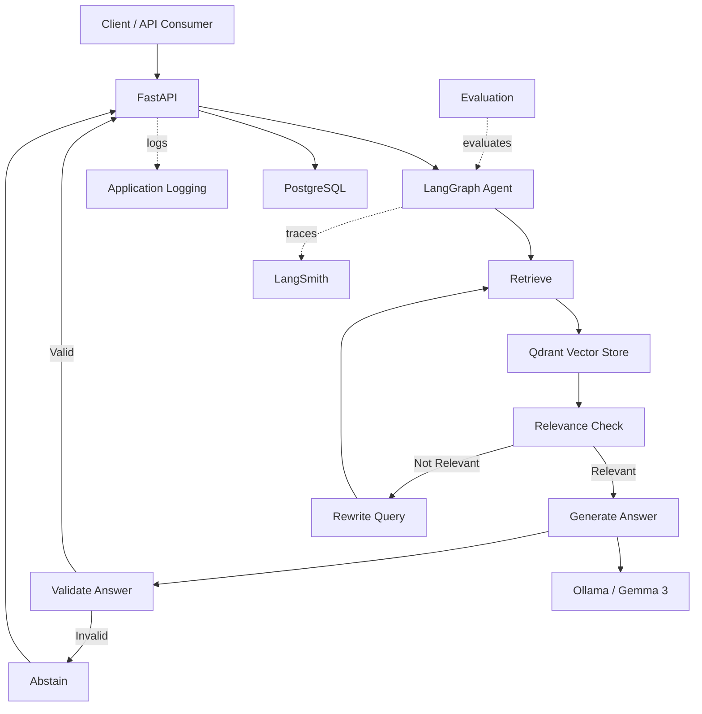

# RAG Agent

A production-oriented Retrieval-Augmented Generation (RAG) agent built with **FastAPI, LangGraph, Qdrant, PostgreSQL, Ollama, LangSmith, Docker, and pytest**.

The project demonstrates an agentic RAG workflow with retrieval relevance checking, bounded query rewriting, grounded answer generation, citation validation, automated evaluation, observability, testing, and containerized deployment.

## Architecture



See [`docs/architecture.md`](docs/architecture.md) for the detailed architecture and [`docs/architecture.svg`](docs/architecture.svg) for the implementation-accurate diagram.

See [`docs/retrieval-optimization.md`](docs/retrieval-optimization.md) for the retrieval experiments and final retrieval decision.

## Core workflow

```text
Question
   │
   ▼
 FastAPI
   │
   ▼
LangGraph
   │
   ▼
Retrieve → Relevance Check
              │
       ┌──────┴──────┐
       │             │
   Relevant       Not Relevant
       │             │
       ▼             ▼
 Generate        Rewrite Query
       │             │
       ▼             └──► Retrieve
 Validate
       │
  ┌────┴────┐
  │         │
 Valid    Invalid
  │         │
  ▼         ▼
 END     Abstain
```

The retry path is bounded to **1 retry**.

## API

### `GET /health`

Checks PostgreSQL and Qdrant connectivity.

### `POST /query`

Accepts a question and returns an answer with structured citation metadata.

Example request:

```json
{
  "question": "How does the LangChain Orchestrator process incoming requests?"
}
```

Example response shape:

```json
{
  "answer": "...",
  "citations": [
    {
      "citation_id": 1,
      "source": "...",
      "page_number": 20,
      "chunk_index": 59
    }
  ]
}
```

## Retrieval

The production retrieval configuration uses:

- Qdrant
- cosine similarity
- 1000-token chunks
- 150-token overlap
- Top-5 retrieval by default
- document/page/chunk metadata for citations

Retrieval alternatives were evaluated rather than assumed to be improvements. Chunking changes, reranking, multi-query retrieval, query rewriting, and candidate-depth diagnostics were tested. The baseline was retained because alternatives did not provide a sufficiently strong overall improvement.

## Citation and grounding

The generation layer is designed to answer from retrieved context and produce page-based citations.

Citation validation checks that citations are present and correspond to retrieved evidence. The evaluation also measures citation correctness and groundedness separately from answer correctness.

If the system cannot produce a safely supported answer, it can abstain instead of fabricating an answer.

## Evaluation

The benchmark contains **10 questions** and evaluates retrieval, generation, and answer quality.

### Final retrieval results

| Metric | Result |
|---|---:|
| Hit Rate@5 | **100.00%** |
| Recall@5 | **91.67%** |
| Precision@5 | **48.00%** |
| MRR@5 | **88.33%** |

### Final generation results

| Metric | Result |
|---|---:|
| Answer Rate | **100.00%** |
| Citation Rate | **100.00%** |
| Relevant Citation Rate | **100.00%** |
| Abstention Rate | **0.00%** |
| Valid Citation Rate | **100.00%** |
| Unsupported Citation Rate | **0.00%** |

### Final answer-quality results

| Metric | Result |
|---|---:|
| Correctness | **90.00%** |
| Groundedness | **100.00%** |
| Citation Correctness | **100.00%** |

The remaining correctness issues were primarily answer precision and scope: one answer was partially incomplete and another included an additional grounded service outside the benchmark reference answer.

## Observability

LangSmith provides visibility into LangGraph execution and generation behavior. Application-level logging is configured for local and containerized runs.

A typical traced workflow contains:

```text
LangGraph
 ├── Retrieve
 ├── Relevance Check
 ├── Rewrite
 ├── Generate
 └── Validate
```

## Testing

Tests cover the major application layers:

```text
tests/
├── agent/
├── api/
├── config/
├── evaluation/
├── generation/
├── ingestion/
├── llm/
└── retrieval/
```

Coverage includes API behavior, configuration validation, agent routing, retrieval, generation, citation handling, evaluation metrics, answer quality, benchmark behavior, and LLM integration.

Targeted tests are used during development; the broader suite is run at checkpoints.

## Docker

The containerized stack contains:

```text
Docker Compose
├── rag-agent-app       FastAPI + LangGraph
├── rag-agent-postgres PostgreSQL 16
└── rag-agent-qdrant   Qdrant
```

Ollama runs on the host and is reached from the application container through `host.docker.internal:11434`.

## Local setup

### Prerequisites

- Python 3.13
- Docker Desktop
- Ollama
- Git

Pull the configured model:

```powershell
ollama pull gemma3
```

### Clone and install

```powershell
git clone https://github.com/Aad-hil/rag-agent.git
cd rag-agent
python -m venv .venv
.\.venv\Scripts\Activate.ps1
pip install -r requirements.txt
```

Copy `.env.example` to `.env` and configure PostgreSQL, Qdrant, Ollama, and optionally LangSmith. Never commit `.env`.

### Run locally

Start PostgreSQL and Qdrant:

```powershell
docker compose up -d postgres qdrant
```

Run the API:

```powershell
uvicorn app.main:app --reload
```

Open the interactive API documentation at `http://127.0.0.1:8000/docs`.

### Run with Docker

```powershell
docker build -t rag-agent:latest .
docker compose up -d
docker compose ps
```

Then open `http://127.0.0.1:8000/docs`.

## Evaluation commands

Full benchmark:

```powershell
python -m app.evaluation.run_benchmark
```

Faster targeted benchmark:

```powershell
python -m app.evaluation.run_targeted_benchmark
```

## Project structure

```text
rag-agent/
├── app/
│   ├── agent/
│   ├── evaluation/
│   ├── generation/
│   ├── ingestion/
│   ├── llm/
│   ├── retrieval/
│   ├── config.py
│   ├── database.py
│   ├── logging_config.py
│   ├── main.py
│   └── vector_store.py
├── data/
│   └── generative-ai-application-builder-on-aws.pdf
├── docs/
│   ├── README.md
│   ├── architecture.md
│   ├── architecture.svg
│   └── retrieval-optimization.md
├── tests/
├── Dockerfile
├── docker-compose.yml
├── requirements.txt
├── .env.example
├── .dockerignore
└── README.md
```

## Engineering decisions

### LangGraph

Makes agent state, retries, routing, validation, and failure paths explicit and testable.

### Qdrant

Provides semantic vector search while preserving document metadata needed for citations.

### Ollama + Gemma 3

Keeps normal development and experimentation local without requiring a paid hosted LLM API.

### LangSmith

Provides execution tracing and visibility into agent behavior.

### Docker

Provides a repeatable application environment and separates the application, PostgreSQL, and Qdrant services.

## Current limitations

This is a portfolio/engineering project, not a claim of internet-scale production deployment.

- Local Ollama inference introduces significant generation latency.
- PostgreSQL is currently an application dependency and health-checked, not the primary conversation-memory store.
- Retrieval precision can still be improved.
- The retry strategy is intentionally limited.
- Answer-quality evaluation uses an LLM judge in addition to deterministic checks.
- The benchmark currently contains 10 questions.

## Future improvements

Potential future work includes:

1. Improved reranking if future evaluation shows a clear overall benefit
2. Better query rewriting
3. Larger evaluation datasets
4. More robust semantic citation verification
5. Conversation memory
6. Streaming responses
7. Authentication and rate limiting
8. CI/CD
9. Production cloud deployment

## Development philosophy

The project was built incrementally, validating each major layer before introducing the next:

```text
Foundation → RAG pipeline → Agent orchestration → API
→ Evaluation → Observability → Testing → Docker
→ Configuration hardening → Final benchmark
→ Documentation → Retrieval optimization → Portfolio polish
```

The goal was not simply to build a chatbot, but to build a RAG system whose behavior can be **inspected, tested, measured, traced, reproduced, and improved systematically**.

## Status

**Current phase: Final portfolio polish**

Core implementation, evaluation, observability, automated testing, Dockerization, configuration hardening, final benchmarking, documentation, and retrieval optimization are complete.

The remaining work is final validation and repository presentation. After that, RAG Agent will be considered complete.
