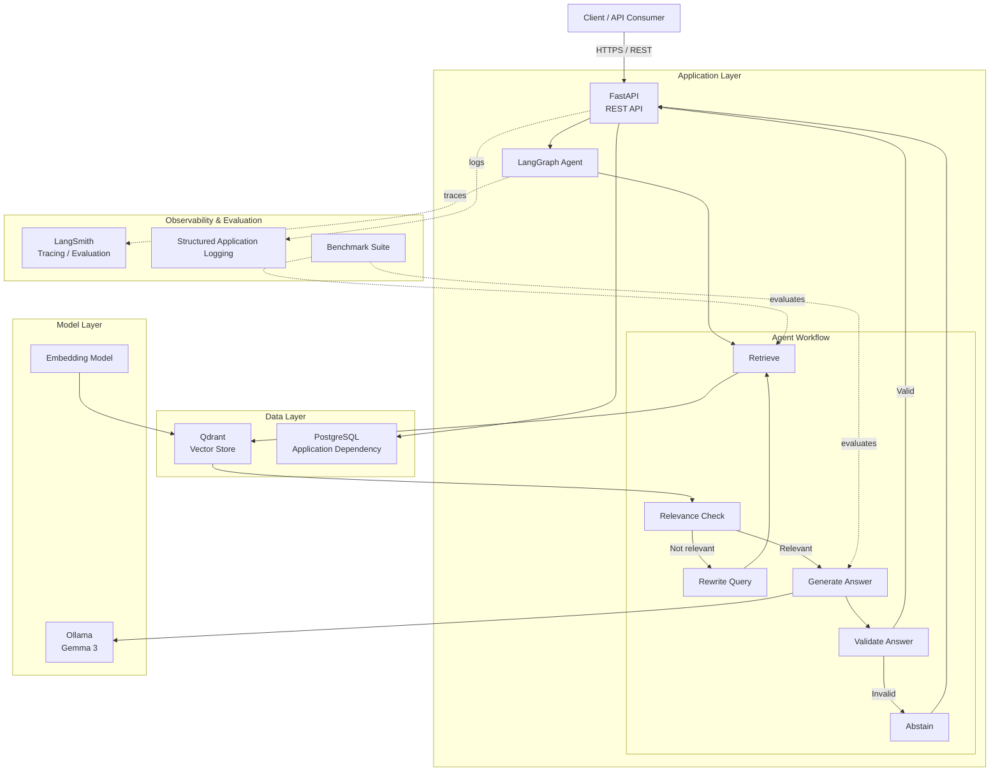

# RAG Agent

A production-oriented Retrieval-Augmented Generation (RAG) agent built incrementally with **FastAPI, LangGraph, Qdrant, PostgreSQL, Ollama, LangSmith, Docker, and pytest**.

The project focuses on more than simply retrieving documents and generating an answer. It implements an agent workflow with **retrieval relevance checking, query rewriting, grounded answer generation, citation validation, automated evaluation, observability, and containerized deployment**.

---

## Overview

The system accepts a natural-language question through a FastAPI endpoint and processes it through a LangGraph stateful workflow:

```text
User Question
      │
      ▼
   FastAPI
      │
      ▼
 LangGraph Agent
      │
      ▼
   Retrieve
      │
      ▼
 Relevance Check
      │
      ├──────────── Relevant ─────────────┐
      │                                   │
      │                                   ▼
      │                              Generate Answer
      │                                   │
      │                                   ▼
      │                              Validate Answer
      │                                   │
      │                                   ▼
      │                              Answer + Citations
      │
      └──── Not Relevant
              │
              ▼
        Rewrite Query
              │
              ▼
           Retrieve
```

The retrieval layer uses **Qdrant** for semantic search, while **Ollama running Gemma 3** provides local LLM inference.

---

## Why this project?

A basic RAG application can often be summarized as:

```text
Question → Vector Search → LLM → Answer
```

That approach does not adequately address several engineering concerns:

- What happens when retrieval returns irrelevant documents?
- How does the system recover from a poor query?
- Can generated claims be traced back to retrieved evidence?
- Can unsupported citations be detected?
- How do we measure retrieval quality independently from generation quality?
- How do we detect groundedness and correctness regressions?
- How can the application be observed and tested?
- Can the system run consistently inside containers?

This project was built to explore those problems systematically.

---

# Architecture

The application is organized into logical layers.



See [`docs/architecture.md`](docs/architecture.md) for the detailed logical architecture, state model, request lifecycle, citation flow, evaluation architecture, and Docker topology.

---

# Core workflow

## 1. Request

The client sends a question to:

```text
POST /query
```

Example:

```json
{
  "question": "How does the LangChain Orchestrator process incoming requests?"
}
```

---

## 2. FastAPI

FastAPI performs request validation and invokes the LangGraph agent.

The API exposes:

```text
GET  /health
POST /query
```

The `/health` endpoint checks connectivity to:

- PostgreSQL
- Qdrant

---

## 3. LangGraph orchestration

The agent is implemented as a stateful LangGraph workflow.

The current workflow is:

```text
START
  │
  ▼
Retrieve
  │
  ▼
Check Relevance
  │
  ├── Relevant ──► Generate Answer
  │                       │
  │                       ▼
  │                 Validate Answer
  │                       │
  │                       ├── Valid ──► END
  │                       │
  │                       └── Invalid ──► Abstain
  │
  ├── Not Relevant
  │
  ▼
Rewrite Query
  │
  ▼
Retrieve
  │
  ▼
...
```

The workflow supports a bounded retry path for poor retrieval.

The current maximum retry count is **1**.

---

# Retrieval

Qdrant is used as the vector database.

The retrieval pipeline is:

```text
Question
   │
   ▼
Embedding
   │
   ▼
Qdrant Semantic Search
   │
   ▼
Top-k Search Results
   │
   ▼
Relevance Evaluation
```

Each retrieved result retains document metadata such as:

- source
- page number
- chunk index
- retrieved text

This metadata is later used for citation generation and validation.

---

# Query rewriting

When retrieved results are judged insufficiently relevant, the agent can rewrite the original query and perform retrieval again.

```text
Original Question
       │
       ▼
   Retrieval
       │
       ▼
 Relevance Check
       │
       └── Not Relevant
              │
              ▼
        Rewrite Query
              │
              ▼
           Retrieval
```

The retry mechanism is intentionally bounded.

---

# Grounded answer generation

Relevant retrieved chunks are converted into structured context and supplied to the local LLM.

The current model path is:

```text
Ollama
└── Gemma 3
```

The generation layer is designed to:

- answer using retrieved context
- avoid unsupported claims
- include citations
- preserve citation metadata
- abstain when an answer cannot be safely supported

---

# Citation system

Generated answers contain page-based citations such as:

```text
The LangChain Orchestrator receives requests through API Gateway and processes them through SQS. [Page 20]
```

The system validates:

1. Whether citations exist
2. Whether citation IDs are valid
3. Whether cited pages belong to retrieved results
4. Whether unsupported citation pages are present

This allows citation correctness to be measured independently from answer correctness.

---

# Evaluation

The project includes a dedicated evaluation framework under:

```text
app/evaluation/
```

The current benchmark contains **10 questions**.

The evaluation covers both retrieval and generation.

## Retrieval metrics

- Hit Rate@5
- Recall@5
- Precision@5
- MRR@5

## Generation metrics

- Answer Rate
- Citation Rate
- Relevant Citation Rate
- Abstention Rate
- Valid Citation Rate
- Unsupported Citation Rate

## Answer quality

- Correctness
- Groundedness
- Citation Correctness

The evaluation framework also contains separate experiment modules for retrieval and generation strategies without changing the frozen production path.

---

# Final benchmark

The final 10-question benchmark produced the following results.

## Retrieval

| Metric | Result |
|---|---:|
| Hit Rate@5 | **100.00%** |
| Recall@5 | **91.67%** |
| Precision@5 | **48.00%** |
| MRR@5 | **88.33%** |

## Generation

| Metric | Result |
|---|---:|
| Answer Rate | **100.00%** |
| Citation Rate | **100.00%** |
| Relevant Citation Rate | **100.00%** |
| Abstention Rate | **0.00%** |
| Valid Citation Rate | **100.00%** |
| Unsupported Citation Rate | **0.00%** |

## Answer quality

| Metric | Result |
|---|---:|
| Correctness | **90.00%** |
| Groundedness | **100.00%** |
| Citation Correctness | **100.00%** |

### Benchmark observations

The benchmark demonstrated that:

- Every evaluated question retrieved at least one relevant page.
- Retrieval recall@5 reached 91.67%.
- All evaluated questions produced answers.
- All generated answers contained valid citations.
- No unsupported citations were detected.
- Groundedness reached 100%.
- Answer correctness reached 90%.

The remaining correctness issues were primarily **answer precision and scope**, rather than unsupported generation. Two questions received partial correctness scores because one answer was somewhat incomplete and another included an additional grounded service that was outside the benchmark reference answer.

---

# Observability

The application integrates with **LangSmith** for tracing and evaluation visibility.

A traced execution can be inspected as a graph containing components such as:

```text
LangGraph
 ├── Retrieve
 ├── Relevance Check
 ├── Rewrite
 ├── Generate
 └── Validate
```

Application-level logging is also configured for local and containerized execution.

---

# Testing

The project includes tests across the major application layers:

```text
tests/
├── agent/
├── api/
├── config/
├── evaluation/
├── generation/
├── ingestion/
├── llm/
└── retrieval/
```

Coverage includes:

- API behavior
- configuration validation
- agent routing
- retrieval
- generation
- citation handling
- evaluation metrics
- answer quality
- benchmark behavior
- LLM integration

Targeted tests are used during development for faster iteration, while the broader suite is run at checkpoints.

---

# Docker

The application can be run with Docker Compose.

The current containerized architecture contains:

```text
Docker Compose
│
├── rag-agent-app
│     └── FastAPI + LangGraph
│
├── rag-agent-postgres
│     └── PostgreSQL 16
│
└── rag-agent-qdrant
      └── Qdrant
```

Ollama runs on the host machine and is accessed by the application container through:

```text
host.docker.internal:11434
```

The application container exposes port `8000`.

---

# Local setup

## Prerequisites

Install:

- Python 3.13
- Docker Desktop
- Ollama
- Git

Pull the configured model:

```powershell
ollama pull gemma3
```

---

## Clone

```powershell
git clone https://github.com/Aad-hil/rag-agent.git
cd rag-agent
```

---

## Create virtual environment

```powershell
python -m venv .venv
```

Activate it in PowerShell:

```powershell
.\.venv\Scripts\Activate.ps1
```

---

## Install dependencies

```powershell
pip install -r requirements.txt
```

---

## Configure environment

Copy `.env.example` to `.env` and configure the required values for PostgreSQL, Qdrant, Ollama, and optionally LangSmith.

Never commit `.env`.

---

# Run dependencies

Start PostgreSQL and Qdrant:

```powershell
docker compose up -d postgres qdrant
```

Verify:

```powershell
docker compose ps
```

---

# Run the API

```powershell
uvicorn app.main:app --reload
```

Open:

```text
http://127.0.0.1:8000/docs
```

---

# Health check

```powershell
curl http://127.0.0.1:8000/health
```

Expected structure:

```json
{
  "status": "ok",
  "service": "rag-agent",
  "dependencies": {
    "postgres": true,
    "qdrant": true
  }
}
```

---

# Query the agent

Example:

```powershell
curl -X POST "http://127.0.0.1:8000/query" `
  -H "Content-Type: application/json" `
  -d '{"question":"How does the LangChain Orchestrator process incoming requests?"}'
```

The response contains an answer and structured citation metadata:

```json
{
  "answer": "...",
  "citations": [
    {
      "citation_id": 1,
      "source": "...",
      "page_number": 20,
      "chunk_index": 59
    }
  ]
}
```

---

# Run with Docker

Build the application image:

```powershell
docker build -t rag-agent:latest .
```

Start the stack:

```powershell
docker compose up -d
```

Check:

```powershell
docker compose ps
```

Then open:

```text
http://127.0.0.1:8000/docs
```

---

# Run evaluation

Full benchmark:

```powershell
python -m app.evaluation.run_benchmark
```

The benchmark evaluates the complete 10-question dataset.

For faster development iterations, targeted evaluation is available:

```powershell
python -m app.evaluation.run_targeted_benchmark
```

---

# Project structure

```text
rag-agent/
│
├── app/
│   │
│   ├── agent/
│   │   ├── graph.py
│   │   ├── relevance.py
│   │   ├── retry.py
│   │   ├── rewrite.py
│   │   ├── state.py
│   │   └── validation.py
│   │
│   ├── evaluation/
│   │   ├── answer_quality.py
│   │   ├── benchmark.py
│   │   ├── chunking_experiment.py
│   │   ├── dataset.py
│   │   ├── evaluator.py
│   │   ├── generation.py
│   │   ├── judge.py
│   │   ├── metrics.py
│   │   ├── multi_query_experiment.py
│   │   ├── reranker_benchmark.py
│   │   ├── reranker_experiment.py
│   │   ├── retrieval.py
│   │   ├── retrieval_diagnostics.py
│   │   ├── rewrite_experiment.py
│   │   ├── run_benchmark.py
│   │   └── run_targeted_benchmark.py
│   │
│   ├── generation/
│   │   ├── answer.py
│   │   └── context.py
│   │
│   ├── ingestion/
│   │   ├── chunker.py
│   │   ├── cleaner.py
│   │   └── ...
│   │
│   ├── llm/
│   │   └── client.py
│   │
│   ├── retrieval/
│   │   └── ...
│   │
│   ├── config.py
│   ├── database.py
│   ├── logging_config.py
│   ├── main.py
│   └── vector_store.py
│
├── docs/
│   └── architecture.md
│
├── tests/
│   ├── agent/
│   ├── api/
│   ├── config/
│   ├── evaluation/
│   ├── generation/
│   ├── ingestion/
│   ├── llm/
│   └── retrieval/
│
├── Dockerfile
├── docker-compose.yml
├── requirements.txt
├── .env.example
├── .dockerignore
└── README.md
```

See [`docs/architecture.md`](docs/architecture.md) for the detailed architecture.

---

# Engineering decisions

## LangGraph

LangGraph was chosen to explicitly model the agent as a stateful workflow instead of hiding orchestration inside a single function.

This makes:

- retries explicit
- state transitions observable
- validation steps testable
- failure paths easier to reason about

## Qdrant

Qdrant provides vector similarity search and metadata associated with retrieved document chunks.

The system preserves document/page/chunk metadata so retrieved evidence can be surfaced as citations.

## Ollama + Gemma 3

The local Ollama setup keeps inference inexpensive during development and experimentation. It also makes the project reproducible without requiring a paid hosted LLM API for normal development.

## LangSmith

LangSmith provides visibility into LangGraph execution and generation behavior.

## Docker

Docker provides a repeatable application environment and separates the application, PostgreSQL, and Qdrant services.

---

# Current limitations

This is intentionally a portfolio/engineering project rather than a claim of internet-scale production deployment.

Current limitations include:

- Local Ollama inference introduces significant generation latency.
- PostgreSQL is currently used as an application dependency and health-checked, but is not yet the primary conversation-memory store.
- Retrieval precision can still be improved.
- The current retry strategy is intentionally limited.
- Answer-quality evaluation uses an LLM judge in addition to deterministic checks.
- The benchmark dataset is currently limited to 10 questions.
- Retrieval optimization experiments have been explored separately but are not part of the frozen production path.

---

# Future improvements

Potential next steps include:

1. Retrieval optimization
2. Improved reranking
3. Better query rewriting
4. Larger evaluation datasets
5. More robust semantic citation verification
6. Conversation memory
7. Streaming responses
8. Authentication and rate limiting
9. CI/CD
10. Production cloud deployment

These are intentionally separated from the current validated baseline.

---

# Development philosophy

The project was built incrementally. Each major layer was implemented and validated before the next layer was introduced:

```text
Foundation
    ↓
RAG pipeline
    ↓
Agent orchestration
    ↓
API
    ↓
Evaluation
    ↓
Observability
    ↓
Testing
    ↓
Docker
    ↓
Configuration hardening
    ↓
Final benchmark
    ↓
Documentation
```

The objective was not simply to produce a working chatbot.

The objective was to build a RAG system whose behavior can be:

- inspected
- tested
- measured
- traced
- reproduced
- improved systematically

---

## Status

**Current phase: Documentation and portfolio polish**

Core application implementation, evaluation, observability, automated testing, Dockerization, production configuration hardening, and final benchmarking are complete.

The next technical focus is retrieval optimization after the documented baseline is preserved.
