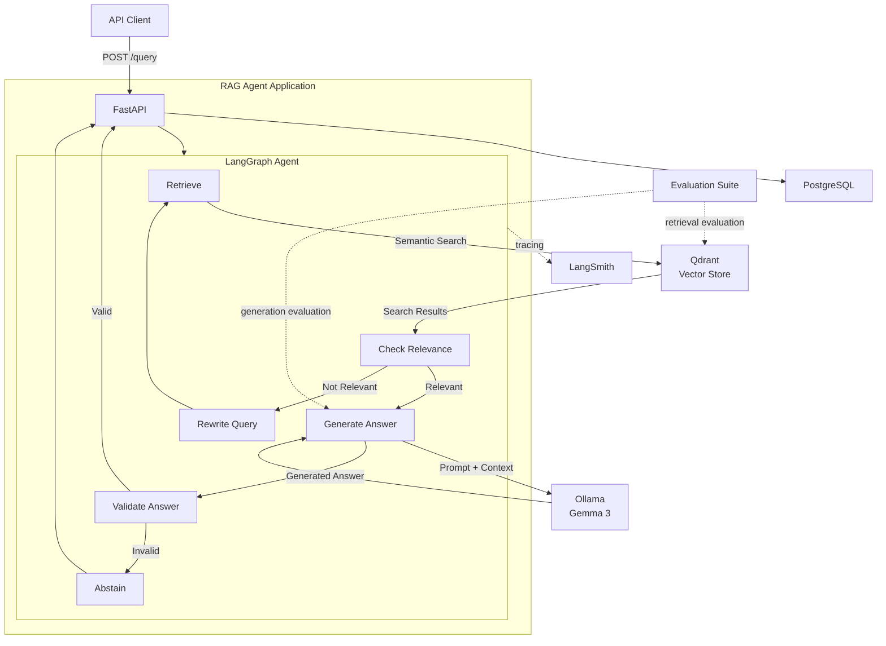

# RAG Agent — Detailed Architecture

This document describes the architecture of the currently implemented RAG Agent. It focuses on the actual application path rather than planned or experimental components.

## 1. System architecture



## 2. Layered architecture

```text
┌────────────────────────────────────────────────────┐
│                    Client Layer                    │
│              API client / curl / Postman           │
└──────────────────────────┬─────────────────────────┘
                           │
                           ▼
┌────────────────────────────────────────────────────┐
│                 Application Layer                  │
│                     FastAPI                        │
│          Validation / Error Handling / API         │
└──────────────────────────┬─────────────────────────┘
                           │
                           ▼
┌────────────────────────────────────────────────────┐
│                    Agent Layer                     │
│                    LangGraph                       │
│                                                    │
│ Retrieve → Relevance → Rewrite → Generate → Validate│
└───────────────┬────────────────────┬───────────────┘
                │                    │
                ▼                    ▼
┌───────────────────────┐   ┌────────────────────────┐
│      Data Layer       │   │       Model Layer       │
│                       │   │                        │
│ Qdrant                │   │ Ollama / Gemma 3       │
│ PostgreSQL            │   │ Embedding model        │
└───────────────────────┘   └────────────────────────┘
                │
                ▼
┌────────────────────────────────────────────────────┐
│             Observability / Evaluation             │
│                 LangSmith + tests                  │
└────────────────────────────────────────────────────┘
```

## 3. Request lifecycle

```text
1. Client sends POST /query
             │
             ▼
2. FastAPI validates request
             │
             ▼
3. LangGraph receives initial state
             │
             ▼
4. Retrieval searches Qdrant
             │
             ▼
5. Retrieved chunks are evaluated for relevance
             │
       ┌─────┴─────┐
       │           │
    Relevant    Not relevant
       │           │
       ▼           ▼
   Generate     Rewrite query
       │           │
       │           └──────► Retrieve again
       │
       ▼
6. Answer generated using retrieved context
       │
       ▼
7. Answer validation
       │
   ┌───┴────┐
   │        │
 Valid    Invalid
   │        │
   ▼        ▼
 END      Abstain
```

The retry path is bounded by the configured maximum retry count.

## 4. LangGraph state

The agent maintains explicit state during execution:

```text
AgentState
│
├── question
├── rewritten_query
├── retry_count
├── results
├── is_relevant
├── answer
└── is_answer_valid
```

This allows graph routing decisions to depend on the current state.

## 5. Retrieval architecture

```text
Question
   │
   ▼
Embedding
   │
   ▼
Qdrant Collection
   │
   ▼
Cosine Similarity Search
   │
   ▼
Top-k Search Results
```

Retrieved results retain metadata used by downstream generation and evaluation, including source, page number, chunk index, and text.

## 6. Relevance and retry

```text
Retrieve
   │
   ▼
Relevance Check
   │
   ├── Relevant ───────────────► Generate
   │
   └── Not Relevant
            │
            ▼
       Rewrite Query
            │
            ▼
         Retrieve
```

The current configuration uses `MAX_RETRIES = 1`, creating a bounded recovery mechanism rather than an unrestricted loop.

## 7. Generation architecture

```text
Retrieved Results
       │
       ▼
Context Builder
       │
       ▼
System Instructions
       +
Question
       +
Retrieved Context
       │
       ▼
Ollama
       │
       ▼
Gemma 3
       │
       ▼
Generated Answer
```

The generation layer produces an answer from retrieved context and preserves citation information.

## 8. Citation architecture

Citations are represented as structured metadata:

```text
Answer
│
├── text
└── citations
      │
      ├── citation_id
      ├── source
      ├── page_number
      └── chunk_index
```

Citation validation checks whether citations exist, citation IDs are valid, cited pages were retrieved, and unsupported citation pages are present.

## 9. Abstention

If the system cannot produce a valid answer after the workflow's validation stage, it can return a safe abstention:

```text
The provided documents do not contain enough information to answer this question.
```

The goal is to prefer an explicit lack-of-evidence response over an unsupported answer.

## 10. PostgreSQL role

PostgreSQL is part of the current application infrastructure. The API health endpoint verifies connectivity using `SELECT 1`.

The current application does not yet use PostgreSQL as its primary conversation-memory store. Conversation persistence is therefore a future extension rather than a currently implemented feature.

## 11. Observability

LangSmith is used for LangGraph tracing and evaluation visibility. A traced execution can be understood as:

```text
LangGraph Run
│
├── Retrieve
├── Check Relevance
├── Rewrite Query       (if required)
├── Generate Answer
└── Validate Answer
```

Application logging is configured separately using Python's logging system.

## 12. Evaluation architecture

The evaluation system is separated from the application runtime:

```text
Evaluation Dataset
       │
       ▼
┌──────────────────┐
│ Retrieval Eval   │
└────────┬─────────┘
         │
         ├── Hit Rate@5
         ├── Recall@5
         ├── Precision@5
         └── MRR@5

       │
       ▼
┌──────────────────┐
│ Generation Eval  │
└────────┬─────────┘
         │
         ├── Answer Rate
         ├── Citation Rate
         ├── Citation Validity
         └── Abstention

       │
       ▼
┌──────────────────┐
│ Answer Quality   │
└────────┬─────────┘
         │
         ├── Correctness
         ├── Groundedness
         └── Citation Correctness
```

## 13. Benchmark dataset

The current benchmark contains 10 questions covering topics such as LangChain Orchestrator behavior, DynamoDB usage, RAG document retrieval, Workflow Builder, Agent Builder, RAG prompt construction, query rephrasing, conversation history, monitoring services, and supported AWS Regions.

The benchmark uses expected document pages and reference answers.

## 14. Final benchmark architecture

```text
Evaluation Question
       │
       ▼
Production Retrieval
       │
       ▼
Top-5 Results
       │
       ├── Retrieval Metrics
       │
       ▼
Production Generation
       │
       ▼
Citation Validation
       │
       ├── Generation Metrics
       │
       ▼
Answer Quality Judges
       │
       ├── Correctness
       ├── Groundedness
       └── Citation Correctness
```

The production retrieval/generation path remains frozen while experimental optimizations are evaluated separately.

## 15. Docker architecture

```text
┌──────────────────────────────────────────────┐
│              Docker Compose                  │
│                                              │
│  ┌────────────────────────────────────────┐  │
│  │ rag-agent-app                          │  │
│  │                                        │  │
│  │ FastAPI + LangGraph + RAG pipeline    │  │
│  │ Port: 8000                            │  │
│  └──────────────┬─────────────┬───────────┘  │
│                 │             │              │
│                 ▼             ▼              │
│       ┌──────────────┐ ┌───────────────┐    │
│       │ PostgreSQL   │ │ Qdrant        │    │
│       │ Port 5432    │ │ Port 6333     │    │
│       └──────────────┘ └───────────────┘    │
│                                              │
└──────────────────────────────────────────────┘
                       │
                       ▼
              Host Ollama / Gemma 3
```

The application container accesses Ollama through `host.docker.internal:11434`. The Qdrant storage volume is external so existing vector data can be preserved across application container rebuilds.

## 16. Experimental evaluation architecture

The repository contains separate experiments involving chunking, retrieval diagnostics, reranking, multi-query retrieval, and query rewriting. These experiments are kept separate from the frozen production path so optimization remains measurable and reversible.

## 17. Performance observation

LangSmith tracing showed that local LLM generation dominates request latency. The architecture therefore keeps retrieval and generation stages distinct so future performance work can target the actual bottleneck.

## 18. Final measured baseline

| Metric | Result |
|---|---:|
| Hit Rate@5 | 100.00% |
| Recall@5 | 91.67% |
| Precision@5 | 48.00% |
| MRR@5 | 88.33% |
| Answer Rate | 100.00% |
| Citation Rate | 100.00% |
| Relevant Citation Rate | 100.00% |
| Abstention Rate | 0.00% |
| Valid Citation Rate | 100.00% |
| Unsupported Citation Rate | 0.00% |
| Correctness | 90.00% |
| Groundedness | 100.00% |
| Citation Correctness | 100.00% |

These values represent the documented baseline for future retrieval and generation optimization.

## 19. Design principles

### Explicit orchestration

Agent behavior is represented as a graph rather than hidden inside a large function.

### Bounded recovery

Query rewriting has a defined retry limit.

### Evidence-first generation

Answers are generated from retrieved context rather than unconstrained model knowledge.

### Structured citations

Citation metadata is represented separately from answer text.

### Measurable quality

Retrieval and generation are evaluated independently.

### Observable execution

LangSmith provides visibility into agent execution.

### Reproducible infrastructure

Docker provides a consistent service environment.

### Incremental development

Each major subsystem was implemented and validated before the next layer was introduced.

## 20. Current architecture vs future architecture

### Implemented

- FastAPI API
- LangGraph orchestration
- Qdrant retrieval
- Query rewriting
- Relevance checking
- Answer validation
- Citation validation
- Ollama / Gemma 3 generation
- PostgreSQL connectivity
- LangSmith tracing
- Automated evaluation
- Docker deployment
- Configuration validation
- Structured logging

### Future

- Persistent conversation memory
- Authentication
- API rate limiting
- Streaming responses
- Larger benchmark datasets
- Advanced semantic citation verification
- Retrieval optimization
- CI/CD
- Cloud deployment

Keeping these boundaries explicit prevents the architecture documentation from overstating the current system.
