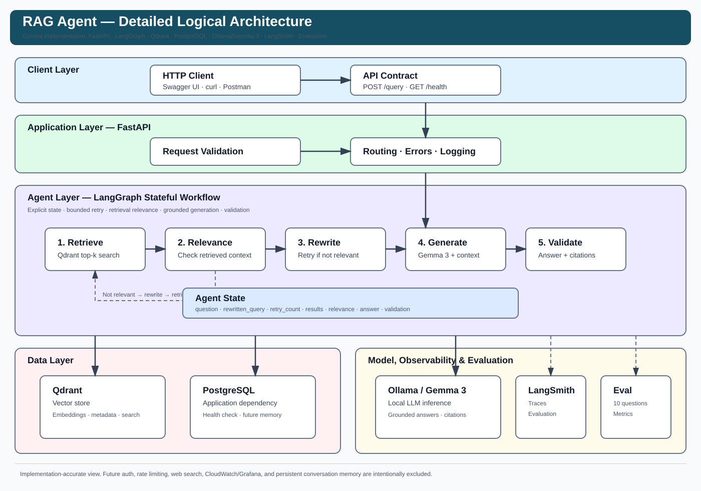

# RAG Agent — Detailed Architecture

This document describes the architecture of the currently implemented RAG Agent. It focuses on the actual application path rather than planned or experimental components.

## Architecture diagram



## 1. System architecture

```text
Client
  │
  ▼
FastAPI
  │
  ▼
LangGraph Agent
  │
  ├── Retrieve ───────────────► Qdrant
  │
  ├── Relevance Check
  │       │
  │       └── Not relevant ───► Rewrite Query ───► Retrieve
  │
  ├── Generate Answer ────────► Ollama / Gemma 3
  │
  └── Validate Answer + Citations
             │
             ├── Valid ───────► Return answer
             └── Invalid ─────► Abstain

PostgreSQL ── application dependency / health check
LangSmith ─── tracing and evaluation visibility
Evaluation ── benchmark and quality measurement
```

## 2. Layered architecture

### Client layer

The current API is consumed through HTTP clients such as the FastAPI Swagger UI, curl, or Postman. The implemented endpoints are `/health` and `/query`.

### Application layer

FastAPI is responsible for request validation, API routing, dependency checks, exception handling, logging, and invoking the LangGraph workflow.

### Agent layer

LangGraph models the RAG workflow as explicit state transitions:

```text
START
  ↓
Retrieve
  ↓
Check Relevance
  ├── relevant ──→ Generate Answer ──→ Validate Answer ──→ END
  │
  └── not relevant ──→ Rewrite Query ──→ Retrieve
                                      
Validation failure ──→ Abstain ──→ END
```

The current retry limit is one rewrite/retrieval iteration.

### Data layer

Qdrant stores document embeddings and metadata used for semantic retrieval and citations. PostgreSQL is currently integrated as an application dependency and is health-checked by the API; it is not yet the primary conversation-memory store.

### Model layer

Ollama provides local model inference using Gemma 3. The embedding model is used by the retrieval pipeline to represent document chunks and queries in vector space.

### Observability and evaluation

LangSmith provides tracing and evaluation visibility. The local evaluation suite measures retrieval, generation, citation behavior, correctness, and groundedness.

## 3. Request lifecycle

1. A client sends a question to `POST /query`.
2. FastAPI validates the request body.
3. The request is passed to the LangGraph agent with an initial retry count.
4. Retrieval searches Qdrant for the top-k relevant chunks.
5. The agent checks retrieval relevance.
6. If results are not relevant and a retry remains, the query is rewritten and retrieval runs again.
7. Relevant context is assembled for generation.
8. Ollama/Gemma 3 generates an answer with citations.
9. Citation and answer validation is performed.
10. The API returns the answer and structured citation metadata, or an abstention response when validation fails.

## 4. Agent state

The workflow maintains explicit state containing the question, optional rewritten query, retry count, retrieved search results, relevance status, generated answer, and answer-validation status.

This makes routing decisions observable and testable instead of embedding control flow inside a single generation function.

## 5. Retrieval

The retrieval path is:

```text
Question
   ↓
Embedding
   ↓
Qdrant semantic search
   ↓
Top-k SearchResult objects
   ↓
Relevance evaluation
```

Search results retain source, page number, chunk index, and text. This metadata is carried forward into the generation and citation layers.

## 6. Query rewriting

When retrieval is judged insufficiently relevant, the agent rewrites the original question and retries retrieval. The retry is bounded to prevent uncontrolled loops.

```text
Retrieve
   ↓
Relevance Check
   └── Not relevant
          ↓
     Rewrite Query
          ↓
       Retrieve
```

## 7. Generation and citations

Retrieved chunks are converted into a structured context and supplied to the local LLM. The answer object contains answer text and structured citation objects.

A citation records information such as:

- citation ID
- source
- page number
- chunk index

Citation evaluation checks whether citations exist, whether their IDs are valid, and whether cited pages were actually retrieved. Unsupported citation pages are separately measured.

## 8. Abstention

If the answer cannot pass the validation stage, the workflow can return:

```text
The provided documents do not contain enough information to answer this question.
```

This creates an explicit failure path instead of requiring the model to produce an unsupported answer.

## 9. PostgreSQL

PostgreSQL is part of the current application infrastructure. The `/health` endpoint executes a simple database connectivity check. Persistent conversation memory is a future extension rather than a current feature.

## 10. Observability

LangSmith traces the agent execution and makes the major workflow stages visible, including retrieval, relevance checking, rewriting when required, generation, and validation. Application logging is configured separately for local and containerized execution.

## 11. Evaluation architecture

The evaluation framework is separate from the normal API runtime and evaluates the production retrieval/generation path.

```text
Evaluation Dataset
       ↓
Production Retrieval
       ↓
Retrieval Metrics
       ↓
Production Generation
       ↓
Citation Validation
       ↓
Answer Quality Judges
```

Retrieval metrics include Hit Rate@5, Recall@5, Precision@5, and MRR@5. Generation metrics include answer rate, citation rate, relevant citation rate, abstention rate, valid citation rate, and unsupported citation rate. Answer-quality metrics include correctness, groundedness, and citation correctness.

## 12. Final measured baseline

The final 10-question benchmark produced:

| Metric | Result |
|---|---:|
| Hit Rate@5 | 100.00% |
| Recall@5 | 91.67% |
| Precision@5 | 48.00% |
| MRR@5 | 88.33% |
| Answer Rate | 100.00% |
| Citation Rate | 100.00% |
| Relevant Citation Rate | 100.00% |
| Abstention Rate | 0.00% |
| Valid Citation Rate | 100.00% |
| Unsupported Citation Rate | 0.00% |
| Correctness | 90.00% |
| Groundedness | 100.00% |
| Citation Correctness | 100.00% |

This baseline is preserved for future retrieval and generation optimization.

## 13. Docker topology

The Docker Compose deployment contains three services:

```text
Docker Compose
│
├── rag-agent-app
│     └── FastAPI + LangGraph + RAG pipeline
│
├── rag-agent-postgres
│     └── PostgreSQL 16
│
└── rag-agent-qdrant
      └── Qdrant
```

Ollama runs on the host machine and is reached by the application container through `host.docker.internal:11434`. The application listens on port `8000`, PostgreSQL on `5432`, and Qdrant on `6333`/`6334`.

## 14. Experimental work

The repository also contains isolated evaluation modules for chunking, retrieval diagnostics, reranking, multi-query retrieval, and query rewriting. These experiments are intentionally separated from the frozen production path so optimization can be measured without silently changing the benchmark baseline.

## 15. Design principles

- **Explicit orchestration:** agent behavior is represented as a graph rather than hidden inside a large function.
- **Bounded recovery:** query rewriting has a defined retry limit.
- **Evidence-first generation:** answers are generated from retrieved context.
- **Structured citations:** citation metadata is represented separately from answer text.
- **Measurable quality:** retrieval and generation are evaluated independently.
- **Observable execution:** LangSmith provides visibility into agent execution.
- **Reproducible infrastructure:** Docker provides a consistent service environment.
- **Incremental development:** major subsystems were implemented and validated before the next layer.

## 16. Current architecture vs future architecture

### Implemented

- FastAPI API
- LangGraph orchestration
- Qdrant retrieval
- Query rewriting
- Relevance checking
- Answer validation
- Citation validation
- Ollama / Gemma 3 generation
- PostgreSQL connectivity
- LangSmith tracing
- Automated evaluation
- Docker deployment
- Configuration validation
- Structured logging

### Future

- Persistent conversation memory
- Authentication
- API rate limiting
- Streaming responses
- Larger benchmark datasets
- Advanced semantic citation verification
- Retrieval optimization
- CI/CD
- Cloud deployment

Keeping these boundaries explicit prevents the architecture documentation from overstating the current system.
